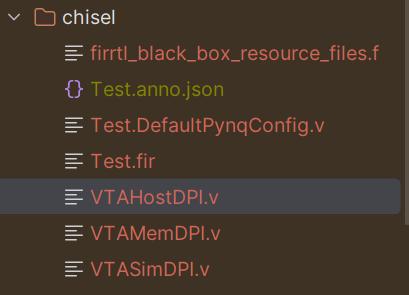

# tvm vta 使用tsim进行仿真测试

* 目录
  * 前言 
  * vta硬件RTL生成
  * 使用verilator生成仿真动态库
  * 编译vta驱动
  * 矩阵乘法TVM Topi定义以及代码生成
  * 仿真验证
* 前言

vta是一个小型但是比较完整的npu RTL，可以通过综合部署到xilinx FPGA上使用。
在部署到fpga硬件之前可以使用verilator进行行为级仿真，看看硬件设计能否输出正确的结果，以及进行一此矩阵乘法的计算需要多少个时钟周期。
这次记录一下tvm+vta，如果使用verilator进行仿真。
* vta硬件RTL生成

hw-vta(https://github.com/apache/tvm-vta)的RTL基于java的chisel库进行开发的，在vta/hardware/chisel这个目录下面。
原本这个项目使用sbt进行编译，但是sbt用起来也不方便，就改成了meaven，pom.xml如下

```xml
<?xml version="1.0" encoding="UTF-8"?>

<project xmlns="http://maven.apache.org/POM/4.0.0" xmlns:xsi="http://www.w3.org/2001/XMLSchema-instance"
         xsi:schemaLocation="http://maven.apache.org/POM/4.0.0 http://maven.apache.org/xsd/maven-4.0.0.xsd">
  <modelVersion>4.0.0</modelVersion>

  <groupId>vat</groupId>
  <artifactId>vta</artifactId>
  <version>0.1.0-SNAPSHOT</version>
  <properties>
    <scala.version>2.12.13</scala.version>
  </properties>

  <name>vta</name>
  <!-- FIXME change it to the projects website -->
  <url>http://www.example.com</url>

  <dependencies>
    <dependency>
      <groupId>org.scala-lang</groupId>
      <artifactId>scala-library</artifactId>
      <version>${scala.version}</version>
    </dependency>
    <dependency>
      <groupId>junit</groupId>
      <artifactId>junit</artifactId>
      <version>4.4</version>
      <scope>test</scope>
    </dependency>
    <dependency>
      <groupId>org.specs</groupId>
      <artifactId>specs</artifactId>
      <version>1.2.5</version>
      <scope>test</scope>
    </dependency>
    <dependency>
      <groupId>edu.berkeley.cs</groupId>
      <artifactId>chisel3_2.12</artifactId>
      <version>3.4.3</version>
    </dependency>

    <dependency>
      <groupId>edu.berkeley.cs</groupId>
      <artifactId>chisel-iotesters_2.12</artifactId>
      <version>1.5.3</version>
    </dependency>

    <dependency>
      <groupId>com.fasterxml.jackson.core</groupId>
      <artifactId>jackson-databind</artifactId>
      <version>2.10.3</version>
    </dependency>
    

  </dependencies>

  <build>
    <sourceDirectory>src/main/scala</sourceDirectory>
    <testSourceDirectory>src/test/scala</testSourceDirectory>
    <extensions>
      <extension>
        <groupId>kr.motd.maven</groupId>
        <artifactId>os-maven-plugin</artifactId>
        <version>1.6.2</version>
      </extension>
    </extensions>

    <plugins>
      <plugin>
        <groupId>net.alchim31.maven</groupId>
        <artifactId>scala-maven-plugin</artifactId>
        <version>4.8.0</version>
        <configuration>
          <scalaVersion>${scala.version}</scalaVersion>
          <args>
            <arg>-Xsource:2.11</arg>
            <arg>-language:reflectiveCalls</arg>
            <arg>-deprecation</arg>
            <arg>-feature</arg>
            <arg>-Xcheckinit</arg>
          </args>
          <launchers>
            <launcher>
              <id>defaultXilinxSimple</id>
              <mainClass>vta.DefaultPynqConfig</mainClass>
              <!-- args are optional -->
              <args>
                <arg>arg1</arg>
              </args>
              <!-- jvmArgs are optional -->
              <jvmArgs>
                <jvmArg>-Xmx128m</jvmArg>
                <jvmArg>-Djava.library.path=./target/classes</jvmArg>
              </jvmArgs>
            </launcher>
            <!-- you could define other launcher -->
            <launcher>
              <id>TestXilinx</id>
              <mainClass>vta.TestDefaultPynqConfig</mainClass>
              <!-- args are optional -->
              <args>
                <arg>--target-dir</arg>
                <arg>xxxxxx/chisel</arg>
                <arg>-o</arg>
                <arg>Test.DefaultPynqConfig</arg>
              </args>
              <!-- jvmArgs are optional -->
              <jvmArgs>
                <jvmArg>-Xmx128m</jvmArg>
                <jvmArg>-Djava.library.path=./target/classes</jvmArg>
              </jvmArgs>
            </launcher>
          </launchers>
        </configuration>
      </plugin>

      <plugin>
        <groupId>edu.berkeley.cs</groupId>
        <artifactId>chisel3-plugin_2.12.13</artifactId>
        <version>3.4.3</version>
      </plugin>

      <plugin>
        <groupId>org.scalamacros</groupId>
        <artifactId>paradise_2.12.13</artifactId>
        <version>2.1.1</version>
      </plugin>
    </plugins>

  </build>
</project>

```
上面的pom.xml添加了chisel以及scala的依赖，通过这个可以进行hw-vta的编译以及运行
```xml
<launcher>
  <id>TestXilinx</id>
  <mainClass>vta.TestDefaultPynqConfig</mainClass>
  <!-- args are optional -->
  <args>
    <arg>--target-dir</arg>
    <arg>xxxxxx/chisel</arg>
    <arg>-o</arg>
    <arg>Test.DefaultPynqConfig</arg>
  </args>
  <!-- jvmArgs are optional -->
  <jvmArgs>
    <jvmArg>-Xmx128m</jvmArg>
    <jvmArg>-Djava.library.path=./target/classes</jvmArg>
  </jvmArgs>
</launcher>
```
下面的这个launcher可以调用vta，生成对应的RTL，这些RTL是system verilog的。后续使用verilator对这些system verilog
进行仿真。这套RTL的输入使用通过tvm vta的驱动将指令集映射成端口上的数据，从而驱动npu进行工作。  
执行完TestXilinx这个程序后，会生成一系列.v文件，如下图所示：  
  
其中的VTAHostDPI.v VTAMemDPI.v 以及VTASimDPI.v里面暴露了C的接口，可以让tvm-vta的驱动把数据作为激励输入到NPU的RTL系统里面  
Test.DefaultPynqConfig.v是TOP 的verilog。生成了这些文件之后，一个VTA的RTL就做好了。
* 使用verilator生成仿真动态库  
有了上述的硬件设计文件以后，就该使用verilator生成可以进行仿真的相关C代码了，这些代码在有数据激励的情况下，可以生成波形，对RTL进行仿真，
并把结果传输到tvm vta的驱动里面。  
  但是windows上的verilator不好使，我就拉了一个ubuntu 20.04的docker 镜像，在镜像里面装上了verilator，
通过一下命令加载镜像：
```shell
docker run -v <Host vta path>:/mnt/d/workspace/project/nn_compiler -it tsc_tvm_deps:v2 /bin/bash
```
这样在镜像可以可以访问到刚才生成的那些.v文件。在linux镜像中使用如下命令生成verilator的仿真源代码
```shell
verilator --cc +define+RANDOMIZE_GARBAGE_ASSIGN +define+RANDOMIZE_REG_INIT +define+RANDOMIZE_MEM_INIT --x-assign unique --output-split 20000 --output-split-cfuncs 20000 --top-module Test -Mdir /mnt/d/workspace/project/nn_compiler/vta-hw/cmake-build-release-mingw_x86_64/verilator -I/mnt/d/workspace/project/nn_compiler/vta-hw/cmake-build-release-mingw_x86_64/chisel --trace /mnt/d/workspace/project/nn_compiler/vta-hw/cmake-build-release-mingw_x86_64/chisel/Test.DefaultPynqConfig.v
```
-Mdir /mnt/d/workspace/project/nn_compiler/vta-hw/cmake-build-release-mingw_x86_64/verilator 表示生成的路径  
--trace /mnt/d/workspace/project/nn_compiler/vta-hw/cmake-build-release-mingw_x86_64/chisel/Test.DefaultPynqConfig.v 
表示需要trace的TOP system verilog文件  
执行完上述命令以后，verilator的仿真源代码就生成好了，通过这些仿真源代码，编译了libvta_hw.so。

* 编译vta驱动  
编译的时候在camke settings里面把tsim打开，并且把verilator的头文件从镜像的/usr/share/verilator拷贝出来
```shell
-DVERILATOR_INC_DIR=<verilator_include_dir_copied_from_docker_image>
-DUSE_VTA_TSIM=ON
```
编译出来的libvta_tsim.so就是tvm_vta的驱动了。驱动采用如下的方式进行加载：
```python
lib_driver = find_libvta(lib_driver_name, optional=(not require_sim))

    if not lib_driver:
        return []

    try:
        libs = [ctypes.CDLL(lib_driver[0], ctypes.RTLD_GLOBAL)]
    except OSError as err:
        if require_sim:
            raise err
        warnings.warn("Error when loading VTA driver {}: {}".format(lib_driver[0], err))
        return []
```
首先tvm先加载驱动libvta_tsim.so，但是光有驱动不行，还需要verilator生成的硬件RTL仿真库，也就之前编译出来的
libvta_hw.so,代码如下所示：
```python
if env.TARGET == "tsim":
    lib_hw = find_libvta("libvta_hw", optional=True)
    assert lib_hw  # make sure to make in ${VTA_HW_PATH}/hardware/chisel
    f = tvm.get_global_func("vta.tsim.init")
    m = tvm.runtime.load_module(lib_hw[0], "vta-tsim")
    f(m)
    return lib_hw
```
使用vta.tsim.init函数加载libvta_hw.so这个DPI Module，完成驱动和RTL仿真库的加载
* 矩阵乘法TVM Topi定义以及代码生成  
采用如下的代码生成gemm.o。.o文件为tvm编译出来的，通过tvm runtime加载就可以执行矩阵乘法的运算
```python
# Output channel factor m - total 16x16=256 output channels
m = 16
# Input channel factor n - total 16x16=256 input channels
n = 16
# Batch factor o (we use single batch inference)
o = 1
# A placeholder tensor in tiled data format
A = te.placeholder((o, n, env.BATCH, env.BLOCK_IN), name="A", dtype=env.inp_dtype)
# B placeholder tensor in tiled data format
B = te.placeholder((m, n, env.BLOCK_OUT, env.BLOCK_IN), name="B", dtype=env.wgt_dtype)
# A copy buffer
A_buf = te.compute((o, n, env.BATCH, env.BLOCK_IN), lambda *i: A(*i), "A_buf")
# B copy buffer
B_buf = te.compute((m, n, env.BLOCK_OUT, env.BLOCK_IN), lambda *i: B(*i), "B_buf")

######################################################################
# Matrix Multiplication
# ~~~~~~~~~~~~~~~~~~~~~


# Outer input feature reduction axis
ko = te.reduce_axis((0, n), name="ko")
# Inner input feature reduction axis
ki = te.reduce_axis((0, env.BLOCK_IN), name="ki")
# Describe the in-VTA matrix multiplication
C_buf = te.compute(
    (o, m, env.BATCH, env.BLOCK_OUT),
    lambda bo, co, bi, ci: te.sum(
        A_buf[bo, ko, bi, ki].astype(env.acc_dtype) * B_buf[co, ko, ci, ki].astype(env.acc_dtype),
        axis=[ko, ki],
    ),
    name="C_buf",
)

######################################################################
# Casting the Results
# ~~~~~~~~~~~~~~~~~~~
# After the computation is done, we'll need to send the results computed by VTA
# back to main memory.


# Cast to output type, and send to main memory
C = te.compute(
    (o, m, env.BATCH, env.BLOCK_OUT), lambda *i: C_buf(*i).astype(env.inp_dtype), name="C"
)


######################################################################
# Default Schedule
# ~~~~~~~~~~~~~~~~
# After we construct the schedule, by default the schedule computes
# :code:`C` in the following way:

# Let's take a look at the generated schedule
s = te.create_schedule(C.op)
print(tvm.lower(s, [A, B, C], simple_mode=True))

######################################################################
# Although this schedule makes sense, it won't compile to VTA.


######################################################################
# Buffer Scopes


######################################################################
# .. note::
#


# Set the intermediate tensor's scope to VTA's on-chip buffers
s[A_buf].set_scope(env.inp_scope)
s[B_buf].set_scope(env.wgt_scope)
s[C_buf].set_scope(env.acc_scope)

######################################################################
# DMA Transfers
# ~~~~~~~~~~~~~


# Move buffer copy into matrix multiply loop
s[A_buf].compute_at(s[C_buf], ko)
s[B_buf].compute_at(s[C_buf], ko)

# Tag the buffer copies with the DMA pragma to insert a DMA transfer
s[A_buf].pragma(s[A_buf].op.axis[0], env.dma_copy)
s[B_buf].pragma(s[B_buf].op.axis[0], env.dma_copy)
s[C].pragma(s[C].op.axis[0], env.dma_copy)

# Let's take a look at the transformed schedule
print(tvm.lower(s, [A, B, C], simple_mode=True))

######################################################################
# Tensorization
# ~~~~~~~~~~~~~


s[C_buf].reorder(
    ko, s[C_buf].op.axis[0], s[C_buf].op.axis[1], s[C_buf].op.axis[2], s[C_buf].op.axis[3], ki
)
s[C_buf].tensorize(s[C_buf].op.axis[2], env.gemm)

# Let's take a look at the finalized schedule
print(vta.lower(s, [A, B, C], simple_mode=True))


# Build GEMM VTA kernel
my_gemm = vta.build(
    s, [A, B, C], tvm.target.Target("ext_dev", host=env.target_host), name="my_gemm"
)

```
具体的原理，我还没完全看明白
* 仿真验证
通过tvm runtime 把数据送入tvm_tsim驱动，tsim驱动借助VTAHostDPI.v暴露的接口把数据送入DPI 仿真模块，最终比较计算的正确性以及消耗了多少了时钟周期
```python
# Get the remote device context
ctx = remote.ext_dev(0)

# Initialize the A and B arrays randomly in the int range of (-128, 128]
A_orig = np.random.randint(-128, 128, size=(o * env.BATCH, n * env.BLOCK_IN)).astype(A.dtype)
B_orig = np.random.randint(-128, 128, size=(m * env.BLOCK_OUT, n * env.BLOCK_IN)).astype(B.dtype)

# Apply packing to the A and B arrays from a 2D to a 4D packed layout
A_packed = A_orig.reshape(o, env.BATCH, n, env.BLOCK_IN).transpose((0, 2, 1, 3))
B_packed = B_orig.reshape(m, env.BLOCK_OUT, n, env.BLOCK_IN).transpose((0, 2, 1, 3))

# Format the input/output arrays with tvm.nd.array to the DLPack standard
A_nd = tvm.nd.array(A_packed, ctx)
B_nd = tvm.nd.array(B_packed, ctx)
C_nd = tvm.nd.array(np.zeros((o, m, env.BATCH, env.BLOCK_OUT)).astype(C.dtype), ctx)

# Clear stats
if env.TARGET in ["sim", "tsim"]:
    simulator.clear_stats()

# Invoke the module to perform the computation
f(A_nd, B_nd, C_nd)

######################################################################
# Verifying Correctness
# ---------------------
# Compute the reference result with numpy and assert that the output of the
# matrix multiplication indeed is correct

# Compute reference result with numpy
C_ref = np.dot(A_orig.astype(env.acc_dtype), B_orig.T.astype(env.acc_dtype)).astype(C.dtype)
C_ref = C_ref.reshape(o, env.BATCH, m, env.BLOCK_OUT).transpose((0, 2, 1, 3))
np.testing.assert_equal(C_ref, C_nd.numpy())

# Print stats
if env.TARGET in ["sim", "tsim"]:
    sim_stats = simulator.stats()
    print("Execution statistics:")
    for k, v in sim_stats.items():
        print("\t{:<16}: {:>16}".format(k, v))
```
最终的结果输出如下：
```python
# from tvm.script import ir as I
# from tvm.script import tir as T

@I.ir_module
class Module:
  @T.prim_func
  def main(A: T.Buffer((1, 16, 1, 16), "int8"), B: T.Buffer((16, 16, 16, 16),
                                                            "int8"), C: T.Buffer((1, 16, 1, 16), "int8")):
    T.func_attr({"from_legacy_te_schedule": T.bool(True), "tir.noalias": T.b
                 ool(True)})
    vta = T.int32()
    with T.attr(T.iter_var(vta, None, "ThreadIndex", "vta"), "coproc_scope",
                2):
      with T.attr(T.iter_var(vta, None, "ThreadIndex", "vta"), "coproc_uop
      _scope", "VTAPushGEMMOp"):
      T.call_extern("int32", "VTAUopLoopBegin", 16, 1, 0, 0)
      T.tir.vta.uop_push(0, 1, 0, 0, 0, 0, 0, 0)
      T.call_extern("int32", "VTAUopLoopEnd")
      T.tir.vta.coproc_dep_push(2, 1)
      for ko in range(16):
        with T.attr(T.iter_var(vta, None, "ThreadIndex", "vta"), "coproc_sco
      pe", 1):
      T.tir.vta.coproc_dep_pop(2, 1)
      T.call_extern("int32", "VTALoadBuffer2D", T.tvm_thread_context(T
                                                                     .tir.vta.command_handle()), A.data, ko, 1, 1, 1, 0, 0, 0, 0, 0, 2)
      T.call_extern("int32", "VTALoadBuffer2D", T.tvm_thread_context(T
                                                                     .tir.vta.command_handle()), B.data, ko, 1, 16, 16, 0, 0, 0, 0, 0, 1)
      T.tir.vta.coproc_dep_push(1, 2)
      T.attr(T.iter_var(vta, None, "ThreadIndex", "vta"), "coproc_scope",
             2)
      T.tir.vta.coproc_dep_pop(1, 2)
      with T.attr(T.iter_var(vta, None, "ThreadIndex", "vta"), "coproc_uop
      _scope", "VTAPushGEMMOp"):
      T.call_extern("int32", "VTAUopLoopBegin", 16, 1, 0, 1)
      T.tir.vta.uop_push(0, 0, 0, 0, 0, 0, 0, 0)
      T.call_extern("int32", "VTAUopLoopEnd")
      T.tir.vta.coproc_dep_push(2, 1)
      T.tir.vta.coproc_dep_push(2, 3)
      T.tir.vta.coproc_dep_pop(2, 1)
      with T.attr(T.iter_var(vta, None, "ThreadIndex", "vta"), "coproc_scope",
      3):
        T.tir.vta.coproc_dep_pop(2, 3)
      T.call_extern("int32", "VTAStoreBuffer2D", T.tvm_thread_context(T.ti
      r.vta.command_handle()), 0, 4, C.data, 0, 16, 1, 16)
      T.tir.vta.coproc_sync()
```
以上是生成的tir，下面是执行的结果
```shell
Execution statistics:
        cycle_count     :             9586
Successful matrix multiply test!
```
可以发现执行完一个(1x256)的向量和一个(256*256)的矩阵用了9586个时钟周期  
1,750.1GOPS如果时钟频率是1GHZ的话

